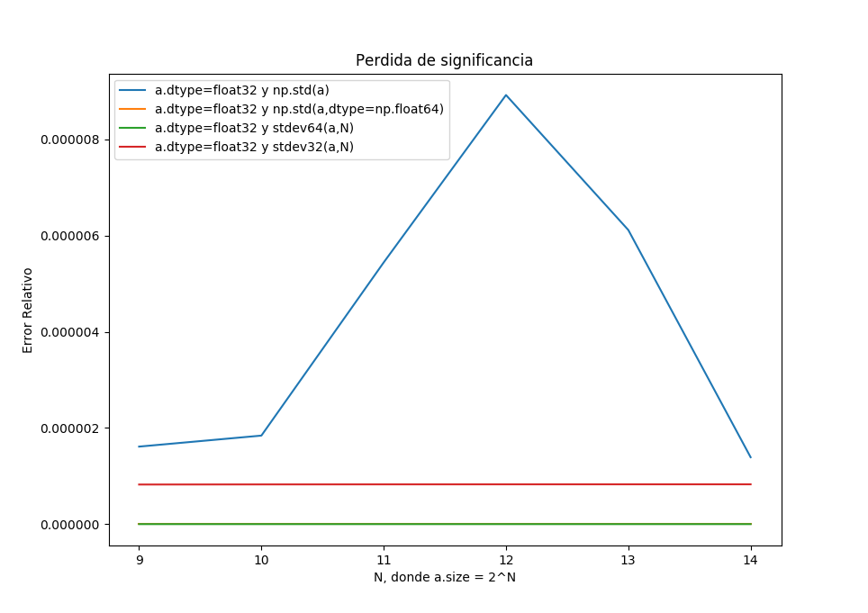
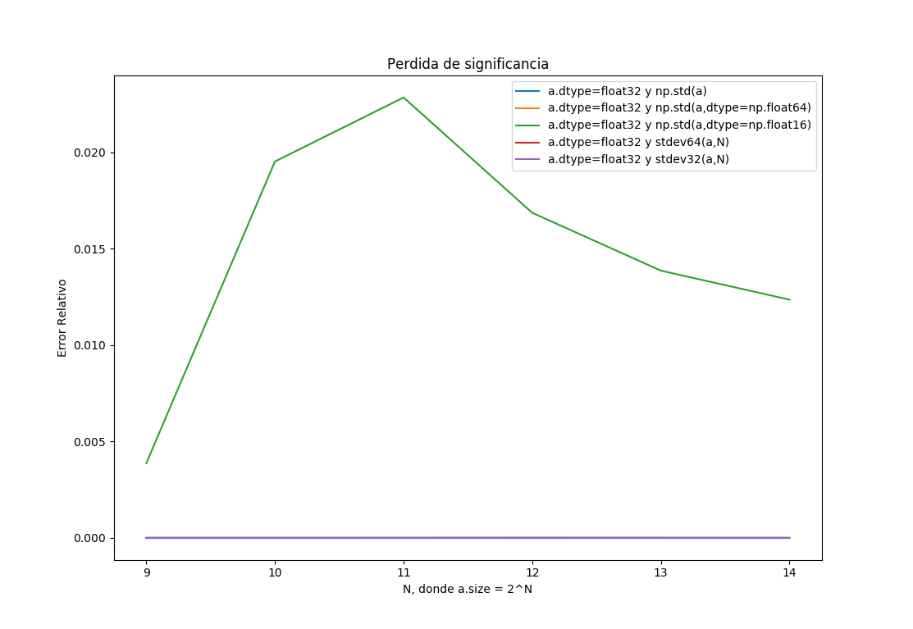

# MCOC-Proyecto-0 Perdida de significancia
MCOC-Proyecto-0

Universidad de Los Andes 2018-20
# Introducción
La perdida de significancia ocurre en calculos numéricos realizados en computador debido a que se considera una menor cantidad de cifras significativas. Dicho fenómeno se ve reflejado en el siguiente ejemplo.
# Perdida de significancia en calculo de desviación estándar 
En este caso se aborda la operación de calculo de desviación estándar `np.std` de una muestra de datos, donde se percibe una perdida de significancia notable al hacer uso de datos `dtype=np.float16`. El ejemplo a plantear en este documento es una discusión mas elaborada de lo que se encuentra especificado en la [documentación de scipy] (https://docs.scipy.org/doc/numpy-1.14.0/reference/generated/numpy.std.html).

Se comparan los siguientes procesos de calculo de desviación estándar:

 1. Definir el arreglo `a` con tipo de datos `dtype=sp.float32` y usar `np.std`. 
 2. Definir el arreglo `a` con tipo de datos `dtype=sp.float32` y usar `np.std` con un acumulador interno de tipo `np.float64`. 
 3. Definir el arreglo `a` con tipo de datos `dtype=sp.float32` y usar `np.std` con un acumulador interno de tipo `np.float16`.
 4. Definir el arreglo `a` con tipo de datos `dtype=sp.float32` y usar una función de desviación estándar `stdev64`, donde en su definición se utilizo el calculo de promedio `np.mean` con un acumulador interno de tipo `np.float64`. 
 5. Definir el arreglo `a` con tipo de datos `dtype=sp.float32` y usar una función de desviación estándar `stdev32`, donde en su definición se utilizo el calculo de promedio `np.mean` con un acumulador interno de tipo `np.float32`.

# Output

Se utiliza el siguiente algoritmo para calculo de error relativo, donde el resultado que se considera exacto es el del segundo caso:

	ERROR = (Standard_deviation_Calculado - Resultado_Exacto) * 100 / Resultado_Exacto
 
 Luego, se muestra en la siguiente figura como se produce la perdida de significancia sin tomar en consideración el caso numero 3, esto ocurre debido al proceso de suma interno que tiene la librería `scipy`.
 
 
 
 En la figura siguiente se aprecia cuan mayor es la perdida de significancia del caso 3 donde se usa un acumulador interno de tipo `np.float16`.
 
  
 
 Output de la consola:
 
       N = 512
       Standard_deviation_1 = 0.450213       ERROR = 1.61227765581e-06 %
       Standard_deviation_2 = 0.450212724315 ERROR = 0.0 %
       Standard_deviation_3 = 0.4502         ERROR = 0.00386746398162 %
       Standard_deviation_4 = 0.450212724315 ERROR = 9.86398619732e-14 %
       Standard_deviation_5 = 0.450212728022 ERROR = 8.23470301698e-07 %
       N = 1024
       Standard_deviation_1 = 0.450107       ERROR = 1.84114747245e-06 %
       Standard_deviation_2 = 0.450107433738 ERROR = 0.0 %
       Standard_deviation_3 = 0.4502         ERROR = 0.0195239525039 %
       Standard_deviation_4 = 0.450107433738 ERROR = 1.23328670158e-12 %
       Standard_deviation_5 = 0.450107437455 ERROR = 8.25652493288e-07 %
       N = 2048
       Standard_deviation_1 = 0.450054       ERROR = 5.44276374756e-06 %
       Standard_deviation_2 = 0.45005398458  ERROR = 0.0 %
       Standard_deviation_3 = 0.44995        ERROR = 0.0228445272818 %
       Standard_deviation_4 = 0.45005398458  ERROR = 2.30652002558e-12 %
       Standard_deviation_5 = 0.450053988301 ERROR = 8.26746990468e-07 %
       N = 4096
       Standard_deviation_1 = 0.450027       ERROR = 8.92503144069e-06 %
       Standard_deviation_2 = 0.450027058951 ERROR = 0.0 %
       Standard_deviation_3 = 0.44995        ERROR = 0.0168627805871 %
       Standard_deviation_4 = 0.450027058951 ERROR = 2.84940109253e-12 %
       Standard_deviation_5 = 0.450027062674 ERROR = 8.27296322042e-07 %
       N = 8192
       Standard_deviation_1 = 0.450014       ERROR = 6.11738039649e-06 %
       Standard_deviation_2 = 0.450013545862 ERROR = 0.0 %
       Standard_deviation_3 = 0.44995        ERROR = 0.013860468879 %
       Standard_deviation_4 = 0.450013545862 ERROR = 7.62330195976e-12 %
       Standard_deviation_5 = 0.450013549587 ERROR = 8.27558189726e-07 %
       N = 16384
       Standard_deviation_1 = 0.450007       ERROR = 1.39103310154e-06 %
       Standard_deviation_2 = 0.450006776749 ERROR = 0.0 %
       Standard_deviation_3 = 0.44995        ERROR = 0.0123564525481 %
       Standard_deviation_4 = 0.450006776749 ERROR = 5.32899026658e-12 %
       Standard_deviation_5 = 0.450006780474 ERROR = 8.27717308651e-07 %
# Anexos

Referidos a perdida de significancia: (https://en.wikiversity.org/wiki/Numerical_Analysis/Loss_of_Significance).

Referido a numpy.std: (https://docs.scipy.org/doc/numpy-1.13.0/reference/generated/numpy.std.html).
